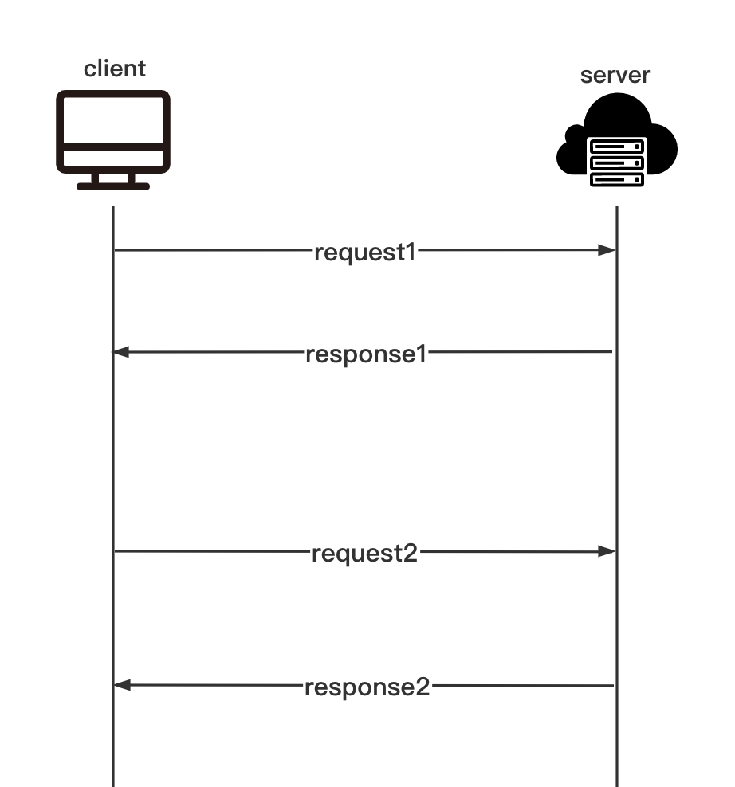
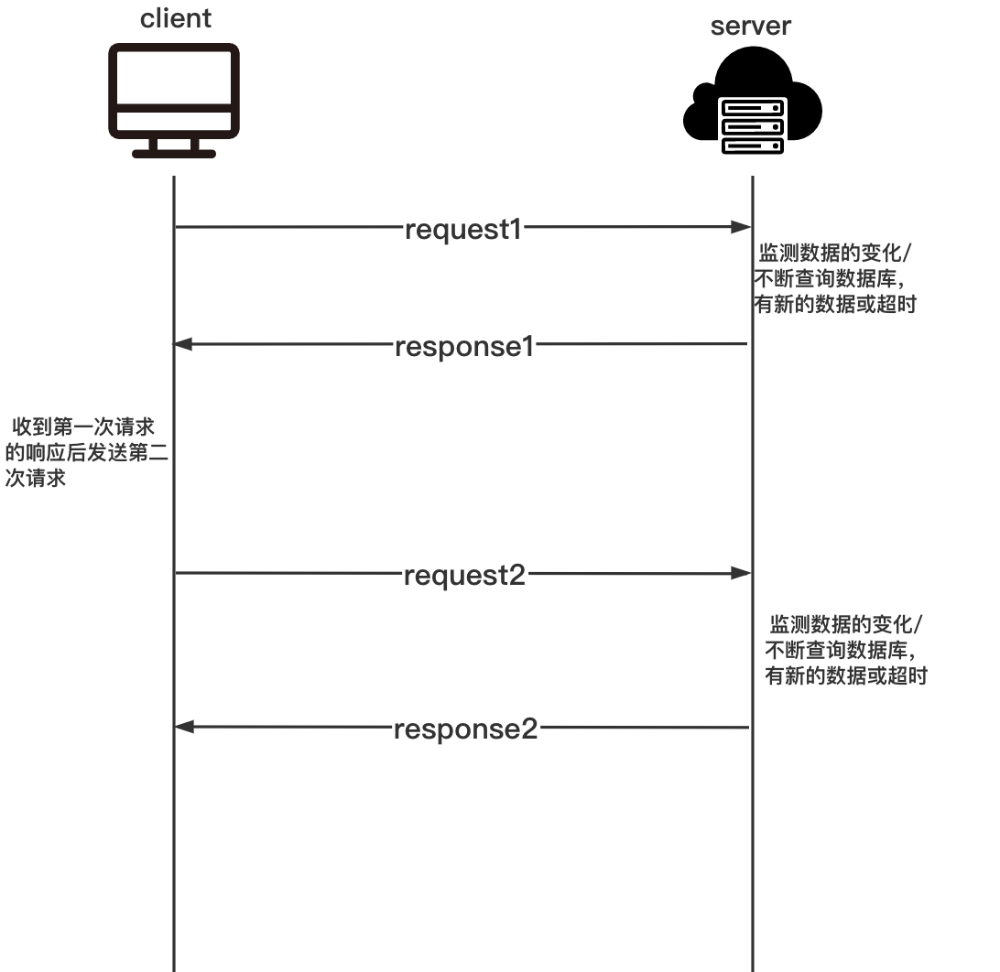
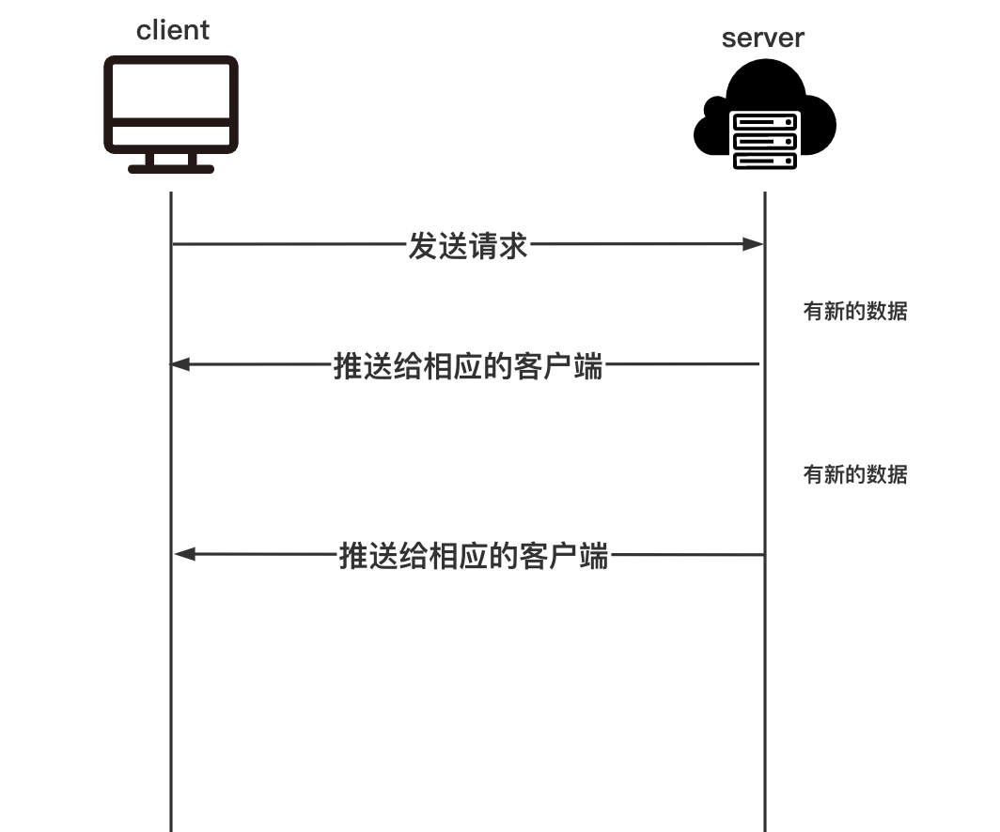
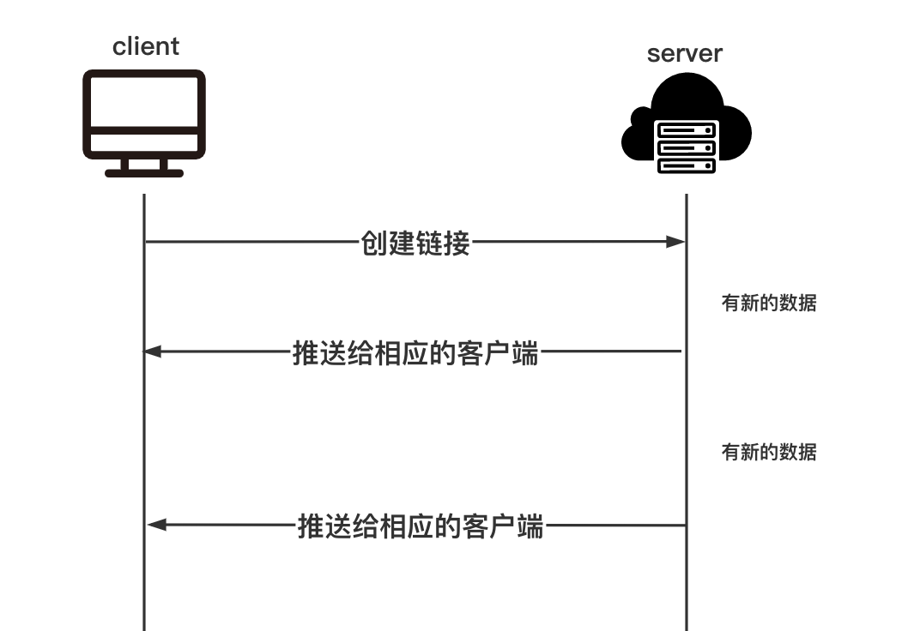

# 物联网数据大屏实时数据展示实现方案
[参考文档](https://cloud.tencent.com/developer/article/1076547)
[参考视频](https://www.bilibili.com/video/BV1Vv411E71v)
## 传统的轮训
客户端每隔一段时间向服务器发送请求获取新的数据。

缺点:
1. 服务端不管有没有新的数据都要返回，这就造成了请求中有大半是无用，浪费带宽和服务器资源。
2. 时效性问题，如果界面每5分钟请求一次，那么数据最大的延迟是5分钟。
3. 不能百分之百保证response1比response2先返回。但是可以通过前端来控制：当收到response1的返回结果后再发送第二次请求（每次请求的时间间隔不确定）。
4. 每次请求返回很多重复数据，浪费网络带宽。可以通过前端请求时携带时间参数来优化。
5. 前端每次获取响应数据后都会重新渲染界面。需要前端判断有新的数据才会重新渲染界面。
## 长轮训
客户端发送请求，服务器收到请求后判断是否有新的数据，如果有新的数据立刻返回；如果没有新数据，服务端会一直检查，直到有新数据或超过设置的超时时间。

缺点:
1. 服务器hold住连同样会消耗服务器消耗资源。
## SSE
* SSE是HTML5新增的功能，全称为Server-Sent Events。它可以允许服务推送数据到客户端。SSE在本质上就与之前的长轮询、短轮询不同，虽然都是基于http协议的，但是轮询需要客户端先发送请求。而SSE最大的特点就是不需要客户端发送请求，可以实现只要服务器端数据有更新，就可以马上发送到客户端。
* SSE的优势很明显，它不需要建立或保持大量的客户端发往服务器端的请求，节约了很多资源，提升应用性能。

## WebSocket
[WebSocket](https://en.wikipedia.org/wiki/WebSocket) 是HTML5开始提供的一种在单个 TCP 连接上进行全双工通讯的协议。WebSocket通讯协议于2011年被IETF定为标准RFC 6455，WebSocketAPI被W3C定为标准。 在WebSocket API中，浏览器和服务器只需要做一个握手的动作，然后，浏览器和服务器之间就形成了一条快速通道。两者之间就直接可以数据互相传送

缺点:
1. 兼容性比较差，有些老版本的浏览器不支持。
2. 实现起来比较困难。